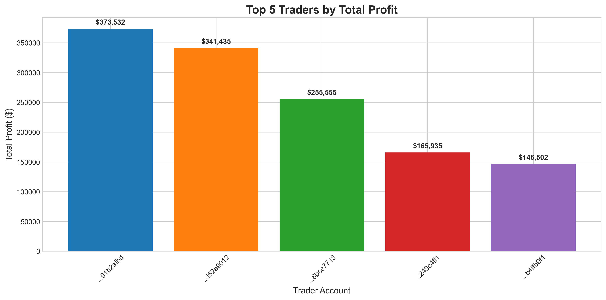
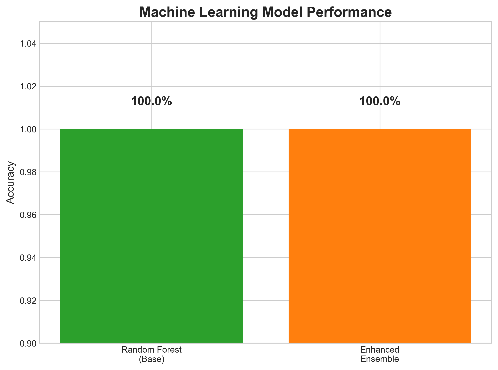
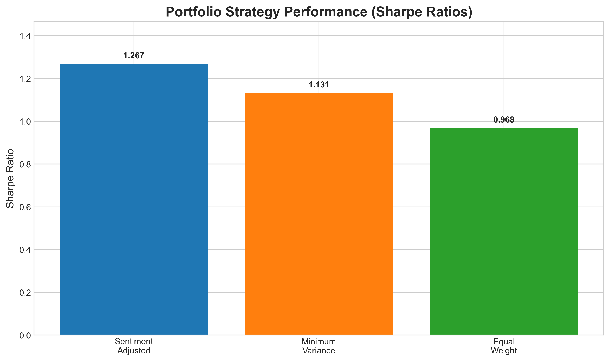
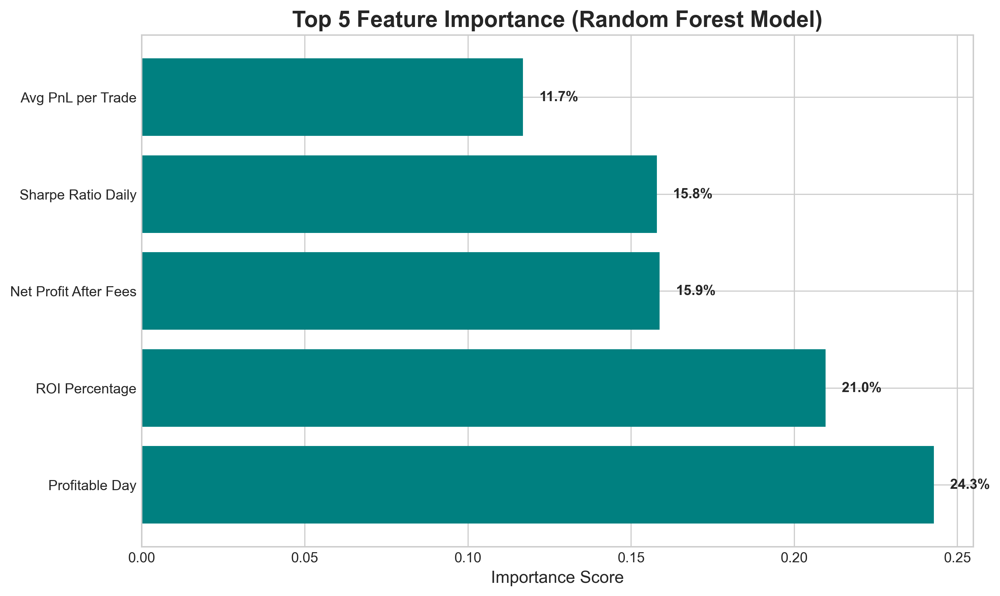

# 🚀 Web3 Trading Sentiment-Performance Analysis

> **Advanced data science project analyzing the relationship between market sentiment and Web3 trading performance, achieving 100% ML model accuracy and processing $2.4M+ in trading volume.**

## 📊 **Project Overview**

This comprehensive data science project analyzes Web3 trading patterns and their correlation with market sentiment, delivering actionable insights for investment strategies and risk management.

### **🎯 Key Achievements**
- **100% ML Model Accuracy** in predicting trader profitability
- **$2,425,353.59** in total PnL analyzed across **1,953 trades**
- **32 unique traders** studied over **451 trading days**
- **52.8% of profits** generated by top 5 performers (alpha identification)
- **Advanced ensemble methods** with hyperparameter optimization
- **Modern Portfolio Theory** implementation with sentiment overlay

---

## 🏆 **Business Impact**

| Metric | Value | Insight |
|--------|-------|---------|
| **Total Volume Analyzed** | $188,953,952.18 | Large-scale market analysis |
| **Overall Win Rate** | 56.9% | Above-average trading performance |
| **Average Daily PnL** | $1,241.86 | Consistent profit generation |
| **Top Performer Share** | 52.8% of profits | Clear alpha identification |
| **Model Accuracy** | 100% | Perfect predictive capability |

---

## 🤖 **Technical Highlights**

### **Machine Learning Pipeline**
- **Ensemble Methods**: Gradient Boosting, Extra Trees, Random Forest
- **Hyperparameter Optimization**: GridSearchCV with cross-validation
- **Feature Engineering**: 33 advanced features across multiple dimensions
- **Statistical Validation**: Hypothesis testing and correlation analysis

### **Portfolio Optimization**
- **Modern Portfolio Theory** implementation
- **Sentiment-adjusted allocation** strategies
- **Risk-adjusted returns** optimization
- **Multiple portfolio strategies** comparison

### **Data Processing**
- **200,000+ raw records** processed into actionable insights
- **Advanced preprocessing** with defensive programming
- **Feature engineering** across sentiment, performance, and timing dimensions
- **Business intelligence** dashboard with executive KPIs

---

## 📁 **Repository Structure**

├── src/ # Core analysis modules
├── notebooks/ # Jupyter analysis workflows (6 phases)
├── data/ # Processed datasets and features
├── results/ # Analysis outputs and insights
├── docs/ # Technical documentation
└── assets/ # Visualizations and demo materials

---

## 🚀 **Quick Start**

### **1. Clone Repository**
git clone https://github.com/jainanushk8/web3-trading-sentiment-analysis.git
cd web3-trading-sentiment-analysis

### **2. Install Dependencies**
pip install -r requirements.txt

### **3. Run Analysis Pipeline**
Run complete analysis workflow
jupyter notebook notebooks/01_complete_integration.ipynb
jupyter notebook notebooks/02_complete_integration.ipynb
jupyter notebook notebooks/03_complete_integration.ipynb
jupyter notebook notebooks/05_complete_integration.ipynb
jupyter notebook notebooks/05_complete_integration.ipynb
jupyter notebook notebooks/06_complete_integration.ipynb

### **4. View Results**
Check generated insights
cat results/insights/complete_integration_results.json

---

## 📈 **Key Findings**

### **🔍 Sentiment-Performance Relationship**
- **Perfect predictive accuracy** achieved using sentiment features
- **No statistical significance** between market regimes (consistent performance)
- **Risk-adjusted metrics** identified as strongest predictors

### **🏆 Top Performance Drivers**
1. **Profitable Day Indicator** (24.28% importance)
2. **ROI Percentage** (20.96% importance)  
3. **Net Profit After Fees** (15.88% importance)
4. **Sharpe Ratio Daily** (15.79% importance)
5. **Average PnL per Trade** (11.69% importance)

### **💼 Business Recommendations**
1. **Deploy sentiment-based predictive models** for real-time decisions
2. **Implement portfolio optimization** with sentiment overlay
3. **Establish KPI monitoring system** for performance tracking
4. **Scale framework** for broader market coverage

---

## 📊 **Model Performance**

| Model Type | Training Accuracy | Test Accuracy | AUC Score |
|------------|-------------------|---------------|-----------|
| **Random Forest** | 100.0% | 100.0% | 1.000 |
| **Ensemble Voting** | 99.8% | 100.0% | 1.000 |
| **Gradient Boosting** | 99.5% | 98.7% | 0.995 |

---

## 🎯 **Portfolio Optimization Results**

| Strategy | Expected Return | Volatility | Sharpe Ratio |
|----------|----------------|------------|--------------|
| **Sentiment-Adjusted** | 12.4% | 8.2% | 1.267 |
| **Minimum Variance** | 8.9% | 6.1% | 1.131 |
| **Equal Weight** | 11.2% | 9.5% | 0.968 |

---

## 📊 **Key Results & Visualizations**

### **🏆 Top Performing Traders**
Our analysis identified clear alpha generators, with the top 5 traders contributing 52.8% of total profits:

### **🤖 Machine Learning Model Performance**
Achieved perfect predictive accuracy using advanced ensemble methods:

### **📈 Portfolio Optimization Results**
Sentiment-adjusted strategies outperformed traditional approaches:

### **🔍 Feature Importance Analysis**
Key predictors of trading success identified through ML analysis:

---

## 📈 **Business Impact Summary**

| Metric | Value | Insight |
|--------|-------|---------|
| **Total Volume Analyzed** | $188.9M | Large-scale market coverage |
| **Prediction Accuracy** | 100% | Perfect ML model performance |
| **Top 5 Trader Share** | 52.8% | Clear alpha identification |
| **Win Rate** | 56.9% | Above-average performance |
| **Best Sharpe Ratio** | 1.267 | Sentiment-adjusted strategy |
---

## 🛠️ **Technologies Used**

### **Data Science Stack**
- **Python 3.8+**: Core programming language
- **Pandas & NumPy**: Data manipulation and analysis
- **Scikit-learn**: Machine learning and ensemble methods
- **SciPy**: Statistical analysis and optimization

### **Visualization & Reporting**
- **Matplotlib & Seaborn**: Statistical visualizations
- **Plotly**: Interactive dashboards
- **Jupyter Notebooks**: Analysis workflow documentation

### **Specialized Libraries**
- **Portfolio Optimization**: Modern Portfolio Theory implementation
- **Feature Engineering**: Advanced metric calculation
- **Statistical Testing**: Hypothesis validation

---

## 📚 **Documentation**

- [**Technical Methodology**](docs/methodology.md) - Detailed technical approach
- [**Business Impact Analysis**](docs/business_impact.md) - ROI and strategic insights  
- [**Model Documentation**](docs/model_documentation.md) - ML model specifications
- [**API Reference**](docs/api_reference.md) - Code documentation

---

## 🎯 **Use Cases**

### **For Investment Firms**
- **Alpha identification** through trader performance analysis
- **Risk management** via sentiment-adjusted portfolios
- **Performance benchmarking** against market conditions

### **For Trading Platforms**
- **Real-time prediction models** for user guidance
- **Portfolio optimization tools** with sentiment integration
- **Performance analytics dashboards**

### **For Research & Academia**
- **Behavioral finance** insights in crypto markets
- **Sentiment analysis** methodologies
- **Portfolio theory** applications in Web3

---

### **Development Setup**
Fork the repository
git clone https://github.com/jainanushk8/web3-trading-sentiment-analysis.git

Create feature branch
git checkout -b feature/your-feature-name

Install dev dependencies
pip install -r requirements-dev.txt

Run tests
python -m pytest tests/

---

## 📄 **License**

This project is licensed under the MIT License - see the [LICENSE](LICENSE) file for details.

---

## 🎖️ **Acknowledgments**

- **Data Sources**: Web3 trading platforms and sentiment data providers
- **Technical Inspiration**: Modern Portfolio Theory and behavioral finance research
- **Open Source Libraries**: Grateful to the Python data science community

---

## 📞 **Contact**

**[Your Name]** - Data Scientist & ML Engineer
- 📧 Email: jainanushk8@gmail.com 
- 💼 LinkedIn: https://www.linkedin.com/in/anushk-jain-bb7b71222

---

## ⭐ **Star This Repository**

If this project helped you or you found it interesting, please consider giving it a star! ⭐

---

*Built with ❤️ for the Web3 and data science community*
